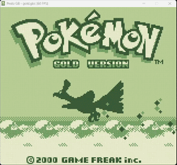

<div align="center">

pesto-gb - An original Game Boy Color Emulator for the ESP32
------------------------------------------
[]()
[]()



</div>

## Building pesto-gb

To build pesto-gb from source, first clone the repository and all of its submodules.

```
git clone https://github.com/h4lfheart/pesto-gb --recursive
```

Then run the build script at the root of the repository. Please ensure you have a compiler installed with C++23 support.

```
./build.sh
```

The output binary will be located in `./release/`.


## Usage

```
pesto_gb <rom> [--dmg-bootrom <path>] [--cgb-bootrom <path>]
```

| Argument | Description |
|---|---|
| `rom` | Path to a `.gb` or `.gbc` ROM file |
| `--dmg-bootrom` | Path to the Game Boy boot ROM (DMG) |
| `--cgb-bootrom` | Path to the Game Boy Color boot ROM (CGB) |

## Keybinds

| Key          | Action |
|--------------|---|
| `Arrow Keys` | D-Pad |
| `X`          | A |
| `Z`          | B |
| `Enter`      | Start |
| `Right Shift` | Select |
| `Tab` (Hold) | Speedup |